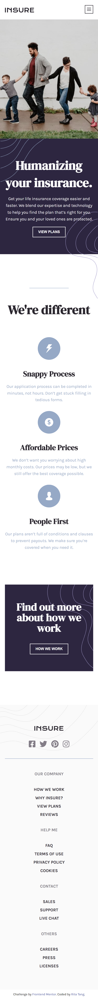
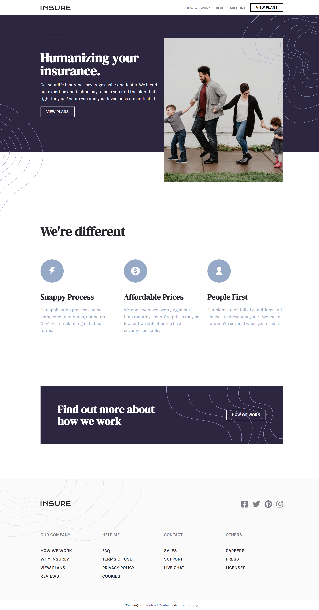

# Frontend Mentor - Insure landing page solution

This is a solution to the [Insure landing page challenge on Frontend Mentor](https://www.frontendmentor.io/challenges/insure-landing-page-uTU68JV8).

## Table of contents

- [Overview](#overview)
  - [The challenge](#the-challenge)
  - [Screenshot](#screenshot)
  - [Links](#links)
- [My process](#my-process)
  - [Built with](#built-with)
  - [What I learned](#what-i-learned)

---

## Overview

### The challenge

The challenge is to build out the project and get it looking as close to the designs inside the `/design` folder as possible. Users should be able to:

- View the optimal layout for the site depending on their device's screen size
- See hover states for all interactive elements on the page

### Screenshot

<details>
<summary style=cursor:pointer><u>Mobile design</u></summary>

</details>

<details>
<summary style=cursor:pointer><u>Desktop design</u></summary>
  
</details>

### Links

- Solution URL: [Here](https://github.com/ritatanght/insure-landing-page)
- Live Site URL: [Here](https://ritatanght.github.io/insure-landing-page/)

### Built with

- Semantic HTML5 markup
- CSS custom properties
- Javascript
- Flexbox
- [Font Awesome](https://fontawesome.com)
- Mobile-first workflow

---

### What I learned

- image can be added to ::before or ::after element by putting the image url to the content property

```css
/* for example */
.header-nav::before {
  content: url(./images/bg-pattern-mobile-nav.svg);
}
```

- If sizing of the image is necessary, it can be set as background image in pseudo-elements.

```css
/* for example */
.intro::before {
  content: "";
  background-image: url(./images/bg-pattern-intro-left-desktop.svg);
  background-size: 100% 100%;
  height: 25em;
  width: 10em;
}
```

**Note:**

- background-size: horizontal vertical;
  - Stretching of the image in the corresponding dimension to the specified percentage of the background positioning area.
- height and width
  - Setting the dimensions of the background area.
